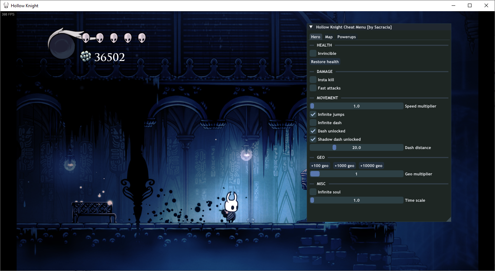

# SDK for developing cheats for Unity games in C++

## TODO

- [ ] Логирование
  - [X] Базовое для разработки
  - [X] Многопоточность
  - [X] Сохранение лога в файл
  - [X] Вывод в консоль
  - [ ] Вложенное логирование
- [ ] Документация
- [X] Dear ImGui хук для OpenGL
- [X] Dear ImGui хук для DirectX 9
- [X] Dear ImGui хук для DirectX 10
- [X] Dear ImGui хук для DirectX 11
- [X] Dear ImGui хук для DirectX 12
- [ ] Dear ImGui хук для Vulkan
- [ ] Реализация хука через оверлей в Steam
- [ ] Реализация хука через оверлей в Discord

- SDK для Mono
  - [X] Работа с функциями игры
  - [X] Работа с полями классов
  - [X] Установка хуков функций
  - [X] Реализация базовых .NET классов
    - [X] List
    - [X] Array
    - [X] String
    - [ ] Dictionary
  - [X] Демонстрационный мод

## Демонстрационный мод

## Демонстрация работы хуков разных графических API
### Stardew Valley (OpenGL)
.png)
### Spelunky (DirectX 9)
.png)
### Battlefield Bad Company 2 (DirectX 10)
.png)
### Vampire Survivors (DirectX 11)
.png)
### Galactic Survivors (DirectX 12)
.png)