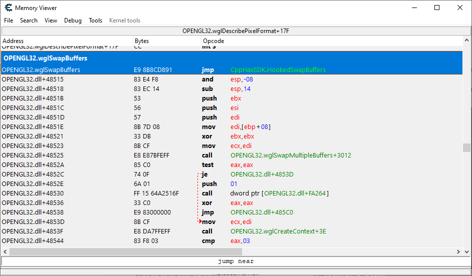
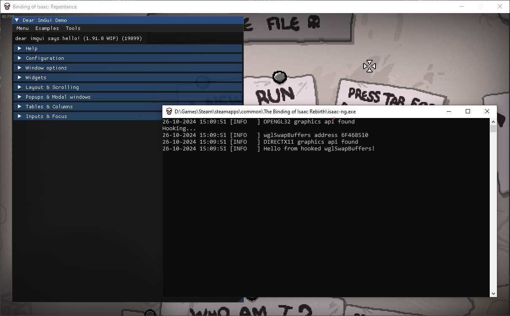
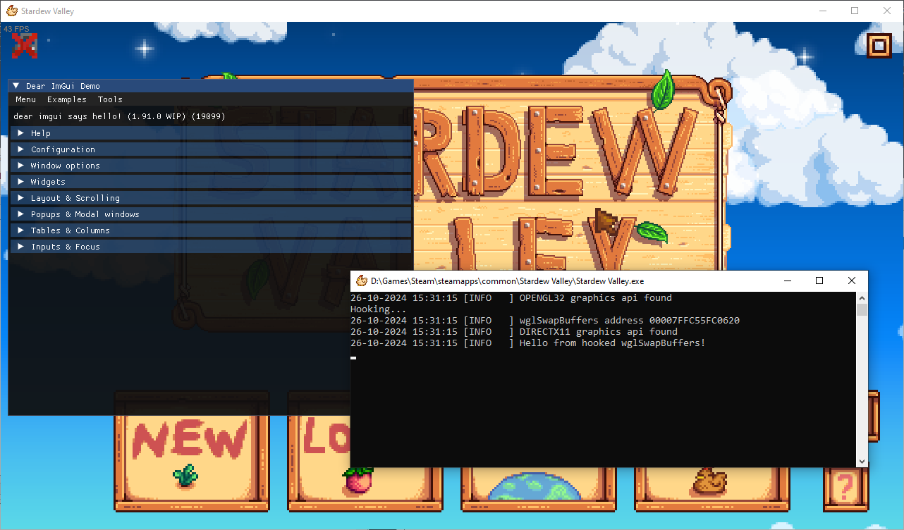

# SDK for developing cheats for Unity games in C++

## TODO

- [ ] Логирование
  - [X] Базовое для собственной разработки
  - [ ] Продвинутое
- [ ] Документация
- [ ] Dear ImGui хук для OpenGL
  - [X] Базовая реализация
  - [ ] Сделать меню невидимым для программ захвата экрана (OBS, ...)
- [ ] Dear ImGui хук для DirectX 9
  - [X] Базовая реализация
  - [ ] Сделать меню невидимым для программ захвата экрана (OBS, ...)
- [ ] Dear ImGui хук для DirectX 10
- [ ] Dear ImGui хук для DirectX 11
- [ ] Dear ImGui хук для DirectX 12
- [ ] Dear ImGui хук для Vulkan
- [ ] Реализация хука через оверлей в Steam
- [ ] Реализация хука через оверлей в Discord

## Как это работает
### OpenGL

TO BE DONE...
### DirectX9
TO BE DONE...
### DirectX10
TO BE DONE...
### DirectX11
TO BE DONE...
### DirectX12
TO BE DONE...
### Vulkan
TO BE DONE...

## Демонстрация
### OPENGL3 32bit

### OPENGL2 64bit
